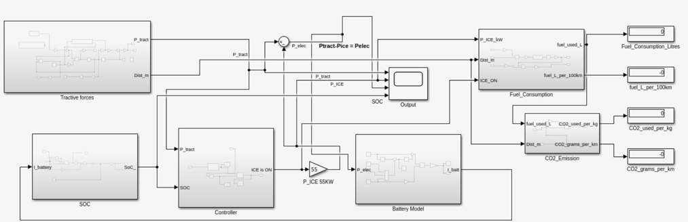

# Series Hybrid Electric Vehicle Powertrain Modelling and Control

MATLAB/Simulink based modelling and simulation project of a **Series Hybrid Electric Vehicle (SHEV)** powertrain with intelligent energy management control.

This project develops a complete hybrid vehicle simulation framework consisting of a 1.4L petrol Internal Combustion Engine (ICE), electric motor, LiFePO4 battery pack, vehicle dynamics model, State of Charge (SOC) estimation and rule-based energy management controller.

The developed controller manages engine-generator operation based on battery SOC and traction power demand to improve fuel efficiency, reduce unnecessary engine operation and maintain battery health.

---

# Project Overview

The simulated vehicle follows a **Series Hybrid Architecture** where:

- The ICE does not mechanically drive the wheels
- The ICE operates as a generator
- The electric motor provides vehicle propulsion
- The battery stores energy from the generator and regenerative braking

The project uses a Hyundai i20 class vehicle with a 1.4L naturally aspirated petrol engine.

---
## Overall Model Architecture

The complete MATLAB/Simulink hybrid powertrain model consists of the vehicle dynamics model, energy management controller, battery model, SOC estimation, fuel consumption calculation and emission analysis blocks.


# Included Files

- `Car_Model_PT_Project_Feedback_Manuscript.slx`
  - Main MATLAB/Simulink hybrid powertrain model

- `Power_cycle120.mat`
  - Driving cycle input data

- `feedback.mat`
  - Controller simulation feedback data

- `Assessment SI i4 1.4L Model.wvm`
  - Ricardo WAVE engine modelling file

- `Advanced Powertrains and Controls Report.pdf`
  - Complete technical documentation

---

# System Architecture

The model contains:

- Vehicle dynamics subsystem
- Tractive force calculation
- ICE generator model
- Electric motor propulsion system
- Battery equivalent circuit model
- SOC estimation block
- Fuel consumption model
- CO₂ emission calculation
- Rule-based energy management controller

---

# Powertrain Configuration

## Vehicle Specification

| Parameter | Value |
|---|---|
| Vehicle type | Compact passenger vehicle |
| Architecture | Series Plug-in Hybrid |
| Engine | 1.4L Inline-4 Petrol |
| Displacement | 1396 cc |
| Maximum Power | 57 kW @ 4250 rpm |
| Maximum Torque | 130 Nm @ 4250 rpm |
| Battery | LiFePO4 |
| Battery Voltage | 400 V |
| Battery Capacity | 40 Ah |

The selected engine operating point was 130 Nm at 4250 rpm, chosen because it provides a balance between torque output, efficiency and emissions behaviour. :contentReference[oaicite:1]{index=1}

---

# Energy Management Controller

A rule-based controller was developed to control ICE activation.

Controller logic:

```
IF SOC < 30%
    Engine ON

OR

IF Traction Power > 45 kW
    Engine ON

Engine remains ON until:

SOC >= 80%

Then:

Engine OFF
```

The controller maintains battery SOC between approximately 30% and 80% to reduce battery stress and avoid unnecessary engine operation. :contentReference[oaicite:2]{index=2}

---

# Battery Model

The battery model uses:

- Equivalent circuit representation
- Open circuit voltage
- Internal resistance
- Battery current calculation
- Coulomb counting SOC estimation
- Peukert effect correction

The SOC model updates battery charge/discharge behaviour while maintaining limits between 0–100%. :contentReference[oaicite:3]{index=3}

---

# Ricardo WAVE Engine Model

A 1-D gas dynamic engine model was developed in Ricardo WAVE.

The model includes:

- Intake system
- Throttle
- Intake runners
- Fuel injection
- Exhaust manifold
- Catalyst system

The generated engine maps were used inside the Simulink hybrid powertrain model for control-focused simulation. :contentReference[oaicite:4]{index=4}

---

# Simulation Features

The model evaluates:

- Vehicle speed response
- Battery SOC behaviour
- Engine operating regions
- Fuel consumption
- CO₂ emissions
- Engine ON/OFF transitions
- Different driving power cycles

---

# Results

The controller achieved:

### Battery Management

- Engine activates when SOC falls below 30%
- Battery charging continues until SOC reaches 80%
- EV-only operation occurs when sufficient battery energy is available

During EV mode the vehicle operates without fuel consumption. :contentReference[oaicite:5]{index=5}

---

# Smart Destination Fuel Predictor

A future driver-oriented control concept was proposed.

The system predicts:

- Route energy requirement
- Available battery energy
- Required engine assistance
- Estimated fuel requirement

Decision logic:

```
IF Available Battery Energy >= Trip Energy

      EV Mode

ELSE

      Planned Engine Assistance Mode
```

The objective is to reduce range anxiety by informing the driver whether a destination can be reached using battery energy alone. :contentReference[oaicite:6]{index=6}

---

# Tools Used

- MATLAB
- Simulink
- Ricardo WAVE
- Simscape
- Vehicle Dynamics Modelling
- Hybrid Energy Management Systems

---

# Limitations

- Vehicle parameters are based on Hyundai i20 class specifications
- Emission modelling is simplified
- Controller uses rule-based logic instead of optimization algorithms
- Hardware validation was not performed

---

# Future Improvements

Possible extensions:

- Model Predictive Control (MPC)
- Dynamic Programming based optimization
- Real-time vehicle data integration
- Hardware-in-the-loop validation
- Machine learning based energy prediction
- Cloud-connected route energy prediction

---

# Author

**Muhammad Wasib**

MSc Automotive Engineering  
Birmingham City University

GitHub:
https://github.com/mwasib01
